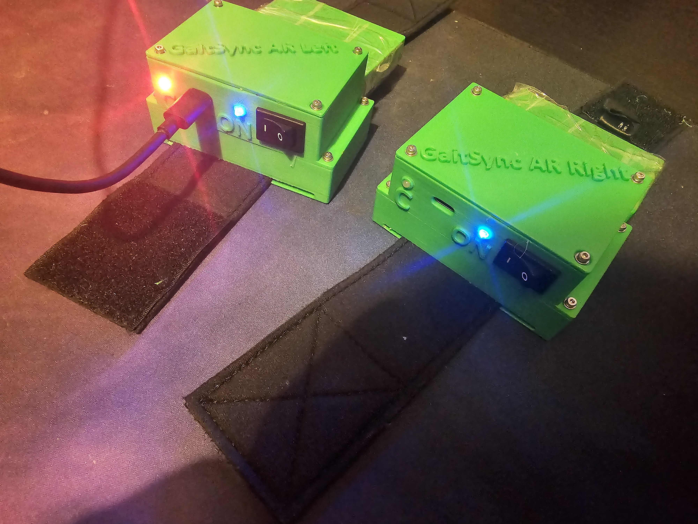

# GaitSyncAR


## Overview
GaitSyncAR is a research driven embedded systems project designed specifically for gait rehabilitation. The system provides a tailored hardware and software solution to accurately monitor and assist participants with highly specific biomechanical tracking needs during physical therapy.

## Hardware Requirements
- Microcontroller: Seeed Studio XIAO nRF52840 Sense
- Sensors: Onboard 6-axis IMU (LSM6DS3TR-C) for continuous motion tracking.
- Custom Hardware: Custom designed carrier circuit.
- Custom 3D-printed enclosures for secure and ergonomic mounting on the participant.

## Software Toolchain
RTOS: Zephyr 4.2.99
Build System: west / CMake / Ninja

## Build and Flash Instructions
```bash
west init -m https://github.com/KarolisBz/GaitSyncAR_NRF_Sense.git --mr main my-workspace
cd my-workspace
west update
```

2. Build the firmware:
```bash
west build -b GaitSyncAR_NRF_Sense app/
```

3. Flash the firmware:
The Seeed XIAO utilizes a UF2 bootloader for simple drag and drop flashing.

- Connect the XIAO to your PC via USB.
- Quickly double-tap the tiny reset button next to the USB port.
- The board will mount to your computer as a mass storage device (like a USB drive).
- Navigate to the build directory: build/GaitSyncAR_NRF_Sense/zephyr/
- Drag and drop the zephyr.uf2 file onto the connected nRF52840 drive. The board will automatically reboot and run the firmware.

4. View Debug Logging
Connect to the board's COM port using a terminal emulator (e.g., PuTTY) or the Zephyr serial monitor at 115200 baud to view real time system logs and sensor outputs.

## Known Issues / Future Work
- Current step detection is poor.
TinyML Integration: Future revisions for the participant aim to replace the current basic thresholding with an embedded Machine Learning model. By training an ML model on the IMU data and deploying it directly to the nRF52840 using TensorFlow Lite for Microcontrollers, the system will achieve far more robust gait analysis.
